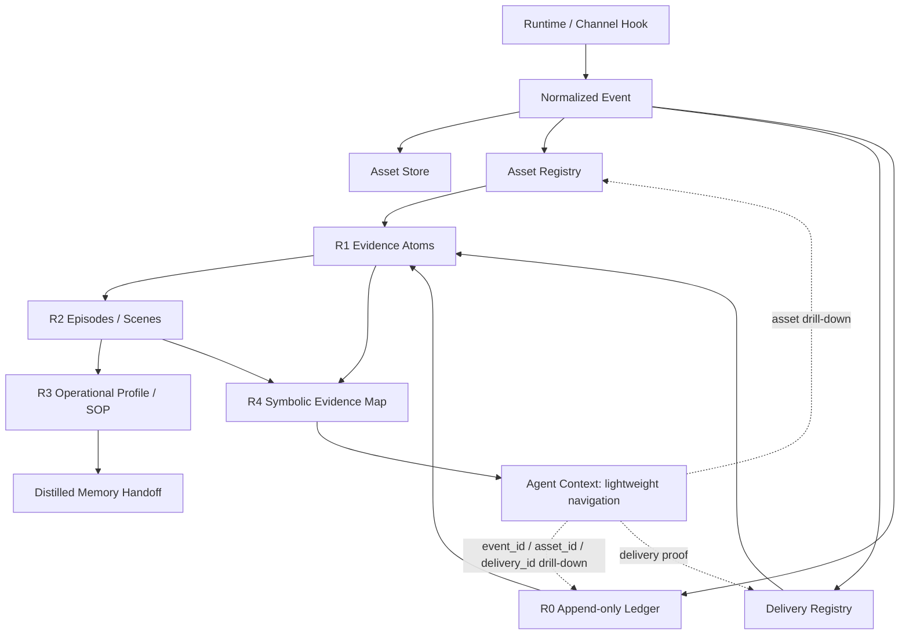

# Raw OS × Agent Memory Layering

## 结论

可以给 Raw OS 做一套类似 TencentDB Agent Memory 的“分层 + 符号化 + 可回溯”体系，但 Raw OS 不应该变成另一个默认记忆插件。

Raw OS 的核心定位仍然是：

```text
runtime / channel event
  -> normalized event
  -> asset registry
  -> append-only ledger
  -> render / audit
  -> evidence retrieval / memory projection
```

也就是说：

- TencentDB Agent Memory 解决的是 **Agent 如何记住、召回、压缩上下文**。
- Raw OS 解决的是 **事实如何被完整捕获、审计、回放、证明**。
- Raw OS 可以向 memory 层输出 projection，但不能把 raw evidence 直接混进默认 recall。

## 对照 TencentDB Agent Memory

### TencentDB Agent Memory

它的主链可以概括为：

```text
L0 Conversation
  -> L1 Atom
  -> L2 Scenario
  -> L3 Persona
  -> recall / prompt injection
```

短期上下文则是：

```text
tool logs
  -> refs/*.md
  -> jsonl step summary
  -> Mermaid task canvas
  -> node_id drill-down
```

强点：

- 分层清楚，不是平铺向量库。
- 高层 markdown / persona 给 agent 低成本使用。
- 底层 L0 / refs 保留可回溯路径。
- Mermaid canvas 适合长任务状态压缩。

风险边界：

- 它是 memory / recall 系统，天然会介入 prompt。
- 如果 raw evidence 直接进入默认 recall，容易污染上下文、放大 token 和检索噪声。
- 对资产、投递、channel metadata 的证据要求不是它的主战场。

### Raw OS

Raw OS 当前主链是：

```text
normalized event
  -> asset capture / store
  -> asset registry
  -> delivery registry
  -> append-only raw ledger
  -> official raw / docx / audit
  -> explicit evidence search
  -> distilled memory handoff
```

强点：

- 先证据，后认知。
- 文本、附件、投递、失败原因分账。
- ledger append-only，可 audit / replay。
- raw-md / docx 是人读产物，不是 source of truth。
- default recall 和 evidence retrieval 已经明确隔离。

短板：

- 目前还缺一个像 L0/L1/L2/L3 那样清楚的“Raw OS projection pyramid”。
- 还缺一个面向 agent 使用的轻量 symbolic index。
- evidence search / memory handoff 还没有产品化成稳定接口。

## 建议给 Raw OS 做的版本

名字暂定：**Raw OS Evidence Memory**。

它不是替代 TencentDB Agent Memory，而是在 Raw OS 上方增加一层“证据投影”。

```text
R0 Evidence Ledger
  原始 normalized event + asset/delivery pointers

R1 Evidence Atom
  从 ledger 中抽取最小事实：谁、何时、在哪个 channel、说了什么、附件是什么、投递是否成功

R2 Episode / Scene
  按 anchor day、topic、task、关系线聚合成可读 episode

R3 Operational Profile / SOP
  稳定偏好、交付规则、系统约束、维护 SOP；只存可被证据支撑的结论

R4 Symbolic Map
  Mermaid / compact graph，用于 agent 快速导航，再通过 event_id / asset_id / delivery_id 下钻
```

核心原则：

- R0 永远是 source of truth。
- R1/R2/R3 都必须带 provenance。
- R4 只做导航，不做事实来源。
- 默认 conversational recall 只吃 R3/R2 的安全 projection。
- 需要原话、附件、投递证明时，走 explicit evidence retrieval。

## Raw OS 版分层图



## 与现有 Raw OS 的落点

已有基础：

- `normalized-event.md` 已定义标准输入。
- `asset-registry.md` 已定义资产证据账。
- `raw_os_core.py` 已有 ledger / asset / delivery / render / audit 基础。
- `README.md` 已明确 retrieval boundary：raw evidence 不进入默认 conversational memory。

下一步可做：

1. `raw-memory-projection` 命令
   - 输入：ledger + asset registry + delivery registry
   - 输出：`raw-memory-md/<day>__<mainline>_memory.md`
   - 内容：R1 atoms + R2 episode summary + provenance refs

2. `raw-evidence-map` 命令
   - 输出 Mermaid / JSON graph
   - 每个 node 带 `event_id` / `asset_id` / `delivery_id`
   - 用于 agent 低 token 导航

3. `evidence-search` 命令
   - 显式检索 raw evidence
   - 不接默认 recall
   - 返回 evidence refs，而不是直接注入大段 raw

4. `memory-handoff` adapter
   - 把 R2/R3 安全投影交给 TencentDB Agent Memory / QMD / 其他 memory 层
   - handoff 里必须保留 source refs

## 不能做的事

- 不能把 raw-md 全文直接塞进默认 memory search。
- 不能让 projection 覆盖 ledger。
- 不能把 asset summary 当作原始资产证据。
- 不能把 delivery intention 当作 delivery success。
- 不能为了“记忆更聪明”牺牲 audit trail。

## 最小 MVP

MVP 不需要先做复杂向量库。

先做一个 stdlib-only projection：

```text
scripts/raw-os project-memory
  --config <config>
  --anchor-day <day>
  --mainline <mainline>
  --out raw-memory-md/<day>__<mainline>_memory.md
```

输出结构：

```md
# Raw Memory Projection

## Evidence atoms
- [event_id] 时间 / speaker / channel / clean_text / assets / delivery

## Episodes
- 主题摘要
- 关键事实
- 未完成事项
- 风险 / incident
- provenance: event_id 列表

## Stable candidates
- 可能进入长期记忆的偏好 / SOP / 关系线事实
- 每条必须带证据 refs
```

验收线：

- ledger 不变。
- projection 可重复生成。
- 每条 summary 可回到 event_id。
- 附件和投递证据不丢。
- 默认 recall 不自动读取 R0/raw-md。

